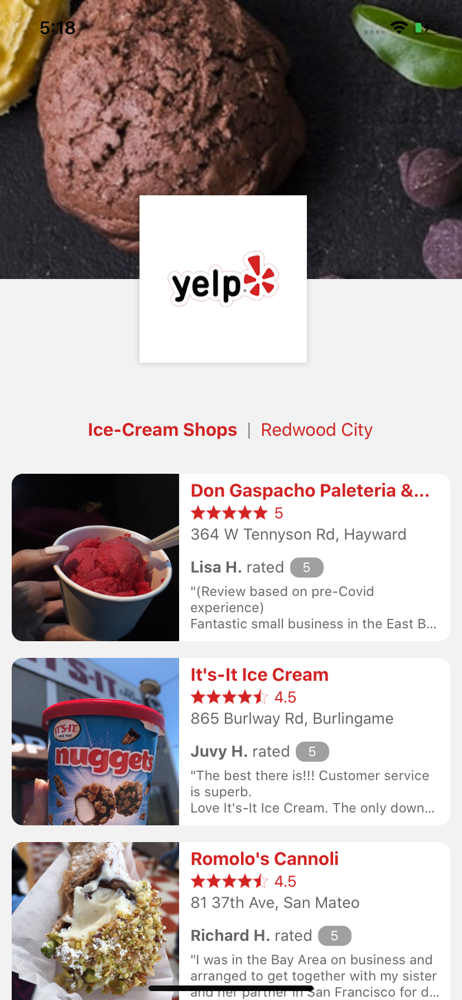

# YelpMobileApp

**I KNOW YOU LOVE ICECREAMS!** :icecream:

Bringing you a simple **React Native** application to list top 10 ice-cream shops near you.


## Requirements

- A pair of hands, even one would do the job :open_hands:
- A working machine :computer:
- [Node.js 10+](https://nodejs.org)
- A development machine set up for React Native by following [these instructions](https://reactnative.dev/docs/environment-setup)
- [ngrock](https://ngrok.com/)
`

## Installation

The easiest way to get started is to clone the repository and install the dependencies with npm

### Setting up the API server
```bash
#Get the latest snapshot of the
git clone git@github.com:nitish1099/yelpapp.git myAPIProject

#Change directory
cd myAPIProject

#Install dependencies
npm install
```

### Setting up the react native application
```bash
#Get the latest snapshot of the repository
git clone git@github.com:nitish1099/yelpmobileapp.git myMobileProject

#Change directory
cd myMobileProject

#Install dependencies
npm install

#Install cocoapods
npx pod install
```


## Usage 

1. Go inside the API server directory that you cloned and type the following command:
```bash
#starts the API application on port 8080
npm start
```
2. Run ngrok on port 8080
```bash
#creates public URL
./ngrok http 8080
```
3. Setup the API endpoint in the React Native app
```bash
inside app/config.js set the BASE_URL to the URL retreived from ngrok
```
4. Install cocoapods for iOS (skip this step for Android)
```bash
npx pod install
```
5. Run the app in your favorite device/emulator to view the webpage
```bash
#android
npx react-native run-android

#iOS
npx react-native run-ios
```

## Screenshot


## Demo
[Demo](https://www.loom.com/share/a44dc70b584b47d1a30ab31010a9b6d7)
